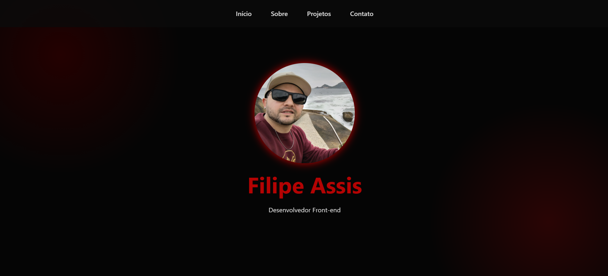

# Portfólio | Filipe Assis

Portfólio pessoal desenvolvido com foco em apresentar projetos, experiência profissional e formas de contato de maneira clara, moderna e responsiva.

🔗 **Acesse o projeto online:**  
👉 https://assisfilipee.github.io/Portfolio/

---

## 📌 Sobre o Projeto

Este projeto foi criado para centralizar minhas informações profissionais e projetos front-end, servindo como vitrine para recrutadores, clientes e parceiros.

O site apresenta uma navegação simples e objetiva, com seções bem definidas, priorizando usabilidade, estética moderna e performance.

---

## 🛠️ Tecnologias Utilizadas

- **HTML5** — Estrutura semântica e acessível  
- **CSS3** — Layout responsivo, estilização moderna e animações  
- **JavaScript** — Interações e integração com WhatsApp  
- **Font Awesome** — Ícones sociais  
- **GitHub Pages** — Deploy do projeto

---

## ✨ Funcionalidades

- Navegação por âncoras  
- Seção de projetos com links externos  
- Formulário de contato com envio direto para WhatsApp  
- Layout responsivo para diferentes dispositivos  

---

## 🚀 Objetivo

Demonstrar minhas habilidades em desenvolvimento front-end, organização de código e construção de interfaces funcionais e visualmente agradáveis, alinhadas às boas práticas do desenvolvimento web.

---

## 📬 Contato

- **LinkedIn:** https://www.linkedin.com/in/assisfilipee  
- **GitHub:** https://github.com/assisfilipee  
- **Instagram:** https://www.instagram.com/assisfilipee  

---

© 2026 • Desenvolvido por **Filipe Assis**
